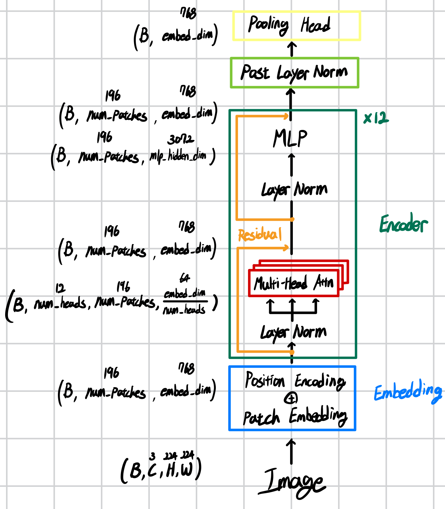

# SigLip from scratch

### run
```bash
uv run compare_origin.py
```

### result
```bash
siglip_custom.shape:  torch.Size([1, 196, 768])
siglip_original.shape:  torch.Size([1, 196, 768])
siglip_original-afterPooling.shape:  torch.Size([1, 768])
cosine_similarity.mean():  tensor(1.0000)
cosine_similarity.min():  tensor(0.9999)
```

### architecture


**Custom Model**

```python
config = SigLipVisionConfig(
    num_channels=3,
    embed_dim=768,
    image_size=224,
    patch_size=16,
    num_attention_heads=12,
    attention_dropout=0.0,
    num_encoder_blocks=12,
    mlp_hidden_dim=3072,
    layer_norm_eps=1e-6
)
custom_model = SigLipVisionModel(config)
print("custom_model : ", custom_model)
```

```bash
custom_model :  SigLipVisionModel(
(transformer): SigLipVisionTransformer(
    (embeddings): VisionEmbeddings(
    (patch_embedding): Conv2d(3, 768, kernel_size=(16, 16), stride=(16, 16), padding=valid)
    (position_embedding): Embedding(196, 768)
    )
    (encoder): SigLipEncoder(
    (encoder_blocks): ModuleList(
        (0-11): 12 x EncoderBlock(
        (layer_norm1): LayerNorm((768,), eps=1e-06, elementwise_affine=True)
        (self_attn): MultiheadAttention(
            (k_proj): Linear(in_features=768, out_features=768, bias=True)
            (v_proj): Linear(in_features=768, out_features=768, bias=True)
            (q_proj): Linear(in_features=768, out_features=768, bias=True)
            (out_proj): Linear(in_features=768, out_features=768, bias=True)
        )
        (layer_norm2): LayerNorm((768,), eps=1e-06, elementwise_affine=True)
        (mlp): MLP(
            (fc1): Linear(in_features=768, out_features=3072, bias=True)
            (fc2): Linear(in_features=3072, out_features=768, bias=True)
        )
        )
    )
    )
    (post_layernorm): LayerNorm((768,), eps=1e-06, elementwise_affine=True)
)
)
```

**Original Model**

```python
from transformers import SiglipVisionModel, SiglipVisionConfig
config = SiglipVisionConfig(vision_use_head=True)   # before pooling : vision_use_head=False
original_model = SiglipVisionModel.from_pretrained("google/siglip-base-patch16-224", config=config)
print("original_model : ", original_model)
```

```bash
original_model :  SiglipVisionModel(
  (vision_model): SiglipVisionTransformer(
    (embeddings): SiglipVisionEmbeddings(
      (patch_embedding): Conv2d(3, 768, kernel_size=(16, 16), stride=(16, 16), padding=valid)
      (position_embedding): Embedding(196, 768)
    )
    (encoder): SiglipEncoder(
      (layers): ModuleList(
        (0-11): 12 x SiglipEncoderLayer(
          (layer_norm1): LayerNorm((768,), eps=1e-06, elementwise_affine=True)
          (self_attn): SiglipAttention(
            (k_proj): Linear(in_features=768, out_features=768, bias=True)
            (v_proj): Linear(in_features=768, out_features=768, bias=True)
            (q_proj): Linear(in_features=768, out_features=768, bias=True)
            (out_proj): Linear(in_features=768, out_features=768, bias=True)
          )
          (layer_norm2): LayerNorm((768,), eps=1e-06, elementwise_affine=True)
          (mlp): SiglipMLP(
            (activation_fn): PytorchGELUTanh()
            (fc1): Linear(in_features=768, out_features=3072, bias=True)
            (fc2): Linear(in_features=3072, out_features=768, bias=True)
          )
        )
      )
    )
    (post_layernorm): LayerNorm((768,), eps=1e-06, elementwise_affine=True)
    (head): SiglipMultiheadAttentionPoolingHead(    # ↓ vision_use_head = True
      (attention): MultiheadAttention(
        (out_proj): NonDynamicallyQuantizableLinear(in_features=768, out_features=768, bias=True)
      )
      (layernorm): LayerNorm((768,), eps=1e-06, elementwise_affine=True)
      (mlp): SiglipMLP(
        (activation_fn): PytorchGELUTanh()
        (fc1): Linear(in_features=768, out_features=3072, bias=True)
        (fc2): Linear(in_features=3072, out_features=768, bias=True)
      )
    )
  )
)
```